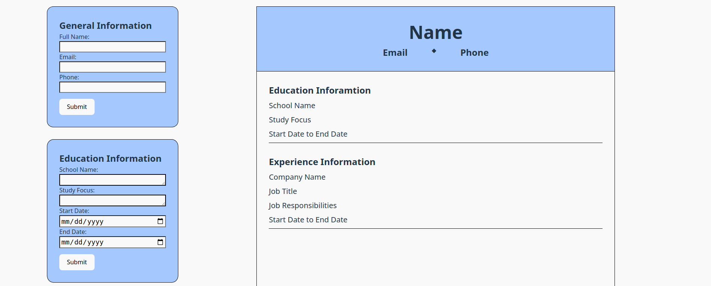
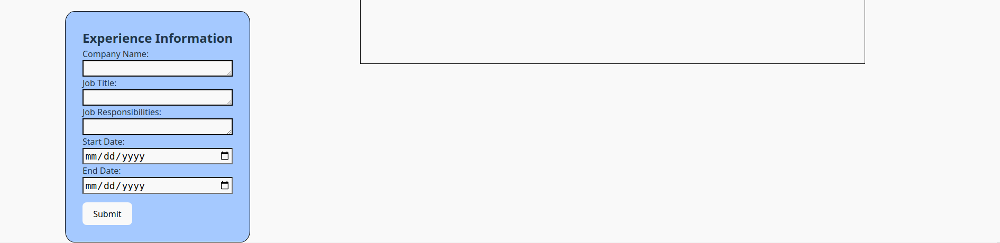

# CV Application Creator

**Objective**

The objective of this project is to create a form in React that will populate a CV application. I used React, HTML, CSS, JSON, Vite, and ESLint in this project.

***Images***

***Features***

1. There are three forms for users to fill out that will populate the CV application page.

    a. General Information Form: This form takes the users Name, Email, and Phone Number. 

    b. Education Information Form: This form takes the users School Name, Study Focus, Start Date and End Date. 
    
    c. Employement Information: This form takes the users Company Name, Job Title, Job Responsibilities, Start Date, and End Date.

2. Users can edit the form after they submit it to the CV page by changing the information and hitting submit again.

